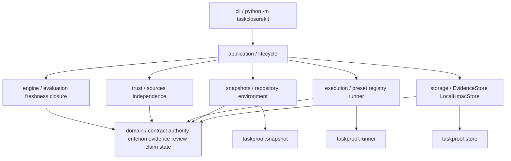

# Архитектура и карта миграции v2.1

## Исходная архитектура

На исходном `151b7b42e1514e217a014bc206f36c614a0ece69` пакет `taskproof` состоит из `__main__.py`, `core.py`, `snapshot.py`, `runner.py`, `store.py`. Core объединяет contract validation, event validation, scope/authority checks и lifecycle. Один preset и один acceptance criterion зафиксированы schema 1; `close` объединяет проверку допустимости и закрытие. Snapshot, bounded runner и HMAC store уже имеют строгие проверки.

Проблема миграции — семантическое смешение этих областей, а не необходимость переписать проверенный filesystem/Git код. V2 вводит отдельные criterion/evidence/review/claim entities и вычисление решения до отдельного closure action. Режим работы агента больше не является центральным domain понятием; он остаётся внешним workflow.

## Зависимости

Это граф ответственности; конкретные файлы могут объединять близкие pure domain types. Domain не импортирует CLI, filesystem, Git, subprocess или persistence. Engine принимает domain inputs и возвращает Evaluation; application связывает trusted capture, хранение и переходы. Presentation сериализует результат и не создаёт новый trust.

## Migration map

| Решение | Исходное | V2 / причина |
| --- | --- | --- |
| **Keep** | Нормализованные пути, проверка physical identity и symlink defenses | Повторное использование snapshot/path helpers через adapter; не заменять лексической проверкой |
| **Keep** | File/Git snapshot, sources/worktree/index binding, hidden/ignored files, bounded traversal и loose object validation | RepositorySnapshot сохраняет прежние fail-closed ограничения |
| **Keep** | Fixed subprocess argv, sanitized environment, timeout/output/resource limits | Bounded v2 runner adapter сохраняет timeout/output/resource checks; legacy runner неизменен |
| **Keep** | HMAC chain, строгие записи и отказ при нарушении integrity | LocalHmacStore за EvidenceStore; HMAC не объявляется identity |
| **Extract** | Contract/acceptance/review/state logic в core | TaskContract, Authority, AcceptanceCriterion, Evidence, AgentAssertion, Review, Claim, Closure, Evaluation и Snapshot — domain types |
| **Replace** | `mode` определяет product lifecycle | Явные authority/evidence/review/claim requirements; режим разработки остаётся вне контракта v2 |
| **Replace** | Единственный hardcoded acceptance label | Отдельные criteria с `all_of`/`any_of` по выбранным presets |
| **Replace** | Один неявный preset | Trusted PresetRegistry с builtin и явной pinned external project configuration; contract выбирает IDs |
| **Replace** | Review JSON + общий close gate | Exact contract/snapshot/evidence-set binding, typed trust/independence и отдельные evaluate/close |
| **Replace** | `CHECKED` фактически означает успешную проверку | Evidence result отдельно от freshness; `CLAIMABLE` отдельно от `CLOSED` |
| **Deprecate** | Schema-1 contract/events и `python3 -m taskproof` | Сохранённый legacy путь; без автоматической конвертации или удаления |
| **Deprecate** | Новые v2 adapters зависят от внутренних v1 helpers | Временный технический seam; extraction позже только с теми же regression gates |
| **Delete later** | Legacy namespace/форматы, old lifecycle helpers | Только будущая отдельно согласованная breaking migration; первый срез ничего из этого не удаляет |

## Состояние и authority

Семантический путь: `DRAFT → AUTHORIZED → BASELINED → ACTIVE → EVIDENCED → REVIEWED → CLAIMABLE → CLOSED`. Не каждый шаг обязан иметь отдельный event: состояние вычисляется из поддержанных событий и текущего snapshot. `BLOCKED`, `STALE`, `INVALID` — проекции причин, а не способ игнорировать prerequisites.

RepositorySnapshot связан с working tree, index, HEAD, Git controls и source bindings. AuthoritySnapshot связан с контрактом, источниками и разрешениями; ExecutionSnapshot — с программой, registry, runner, executable и ограниченным environment. Изменение любой релевантной идентичности инвалидирует зависящие evidence/evaluation/review. Новый check может освежить разрешённое изменение кода, но не узаконить изменившуюся authority или запись вне scope.

Task/closure authority использует подтверждение локального оператора для exact digest с `host_operator_assumed`, `identity_verified=false`. Это ограниченная модель доверия, не доказательство человеческой identity. Agent import остаётся agent-attested; required independence без provider остаётся UNKNOWN.

## External evidence seam

Source adapter для будущего `measured_ci` должен подтвердить repository, exact commit, соответствие commit проверяемому repository snapshot, trusted workflow identity, выбранную успешную check и mapping criterion. CI PASS для HEAD не подтверждает dirty worktree или index. В срезе есть fake/test adapter; он проверяет форму и binding на синтетических данных. Trusted local observer `bind_commit` выдаёт CommitSnapshotBinding только после clean repository status и стабильного bounded capture; fake adapters находятся в tests. Никакая сеть или реальный CI не используется и не доказывается. Недоверенный downstream rendering/API не меняет trust class сохранённого evidence.

## Риски и границы следующей миграции

Security regression снижается повторным использованием строгих primitives и tests, а не названием новой папки. Compatibility ограничена отдельным v1 CLI: старые journals не становятся v2. Overengineering сдерживается одним claim, минимальными project capabilities и отсутствием SDK/policy DSL. Конкурентная граница — bounded task closure, а не общая memory/evidence/control plane. Naming gate проверен отдельно; имя не предоставляет права на release или изменение GitHub.

## Минимальное расширение v2.1

Project configuration находится вне проверяемого repository/store и загружается явно при CREATE. Registry definition digest, physical config identity и authority inputs принадлежат authority snapshot, executable/runtime identity — execution snapshot. Local operator подтверждает bound authority; renderer/contract не назначают trust. Изменённая config требует нового task, а не автоматического принятия новой команды.

Check adapter принимает registered definition и выполняет без shell фиксированные argv, environment, cwd rule и limits. До/после проверяются conservative full snapshots; declared permitted writes должны одновременно входить в contract write scope. Relevant inputs явно объявляются категориями, но dependency graph не угадывается. Такой подход может инвалидировать дополнительные проверки и имеет прежние bounded IO/Git-layout ограничения. Он не ограничивает hostile process средствами ОС.

Review verdict, trust source, independence и freshness остаются самостоятельными свойствами. Authority class `operator_confirmed` отделена от legacy `human`/`human_confirmed` strings и от `identity_verified=false`.

Внешний workflow, agent host, orchestrator или automation читает [существующий CLI envelope](CLI.md#machine-envelope) и передаёт обычный bounded task contract. Proposal/spec/design/decomposition остаются внешнему workflow; domain не приобретает эти зависимости. [Reference mapping](WEB_APP_TEMPLATE_REFERENCE.md) описывает engineering-shaped usage без исполнения внешнего template.
