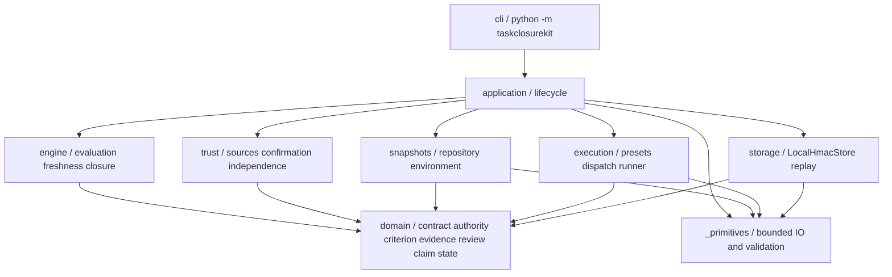

# Архитектура TaskClosureKit

CLI, application, domain, engine, snapshots, execution, storage и trust имеют разные обязанности. Публичный CLI — `python3 -m taskclosurekit` из исходников и `taskclosurekit` через thin npm launcher. Контракт `taskclosurekit/v2` отделяет authority, acceptance, evidence, review, claim и closure; режим разработки остаётся во внешнем workflow.

Domain не импортирует CLI, filesystem, Git, subprocess, storage или private primitives. Engine принимает domain inputs и возвращает Evaluation. Application связывает trusted capture, persistence и явные переходы. Presentation сериализует результат и не создаёт trust.

## Закрытые primitives

| Модуль | Обязанность |
| --- | --- |
| `_primitives.snapshot` | Физическая идентичность и exact spelling путей, symlink/race defenses, bounded inventory и чтение, проверка loose Git objects и source/index binding |
| `_primitives.policy` | Структурная проверка снимков, неизменность источников и Git controls, сравнение изменений с write scope |
| `_primitives.runner` | Фиксированный builtin whitespace argv и Git metadata reads, sanitized environment, timeout/output/resource limits |
| `_primitives.store` | Private atomic HMAC journal, sequence/run binding, bounded JSON и fail-closed integrity read |

Это внутренний слой текущего продукта, а не второй CLI. Старый contract validator, event lifecycle и entry point удалены. `TaskContract.snapshot_policy()` передаёт private policy только данные, необходимые для проверки sources и write scope. Public API остаётся контрактом и CLI, а не private helpers.

Execution identity включает полные деревья `taskclosurekit/` и `tests/`, системный Git, Python и профиль исполнения. Корень определяется относительно расположения private snapshot module. Отсутствующее дерево, неподдержанная запись, лимит или гонка блокируют capture. Тесты остаются входом execution identity source/npm distribution. `taskclosurekit/launcher.cjs` и `_npm_bootstrap.py` находятся внутри program root; npm payload включает полные Python trees `taskclosurekit/` и `tests/`. Bootstrap добавляет только trusted package parent после isolated Python startup. Node/npm runtime и package metadata вне roots не аттестуются. Установщик Python runtime отсутствует; Node wrapper не меняет domain contract. [CLI](CLI.md#npm-launcher) описывает runtime selection, signals и platform limits.

## Состояние и authority

Семантический путь: `DRAFT → AUTHORIZED → BASELINED → ACTIVE → EVIDENCED → REVIEWED → CLAIMABLE → CLOSED`. `BLOCKED`, `STALE`, `INVALID` отражают причины и не отменяют prerequisites. Repository snapshot связан с working tree/index/HEAD/Git controls; authority — с contract/sources/preset definitions и dispatch inputs; execution — с программой, runtime и environment. Изменение связанного состояния инвалидирует evidence и review. Новый check не узаконивает изменившуюся authority.

Project config физически находится вне repository/store, фиксируется при CREATE и подтверждается оператором. Runner исполняет registered argv без shell. До/после проверяются conservative snapshots; output writes одновременно принадлежат preset definition и contract scope. Полный dependency graph не выводится автоматически, hostile process не изолируется средствами ОС.

Review verdict, source trust, independence и freshness независимы. Local operator подтверждает exact digest с `host_operator_assumed=true` и `identity_verified=false`. Agent import остаётся agent-attested; required independence без trusted provider остаётся UNKNOWN.

## Внешние interfaces

[CLI envelope](CLI.md#machine-envelope) предназначен внешнему workflow. Proposal/spec/design, decomposition и model selection остаются его ответственностью. [Reference mapping](WEB_APP_TEMPLATE_REFERENCE.md) не исполняет внешний проект.

`measured_ci` имеет seam и fake/test adapter. `bind_commit` создаёт CommitSnapshotBinding только после clean repository status и стабильного bounded capture. CI PASS для HEAD не доказывает dirty worktree/index. Реального сетевого CI adapter нет; JSON не назначает trust.

[Границы безопасности](SAFETY_BOUNDARIES.md), [контракт](V2_CONTRACT.md) и [совместимость](COMPATIBILITY.md) фиксируют поддержанные ограничения. Ни имя, ни green checks не разрешают публикацию или deployment.
